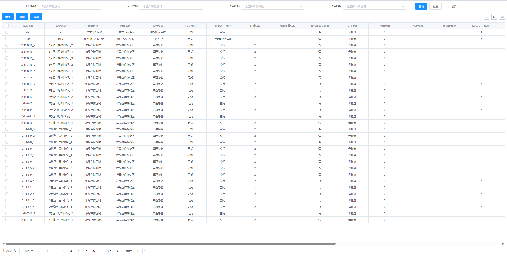
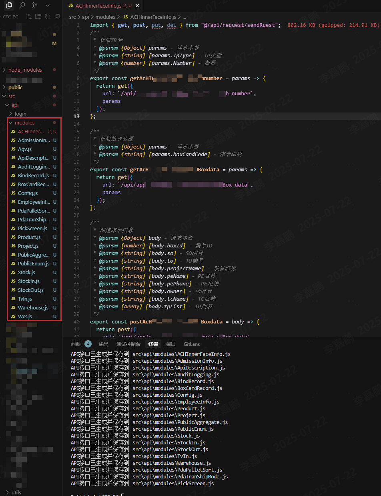
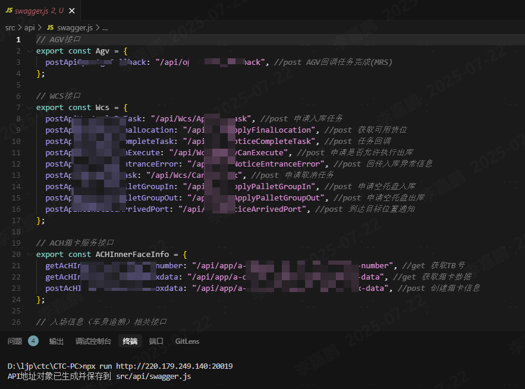
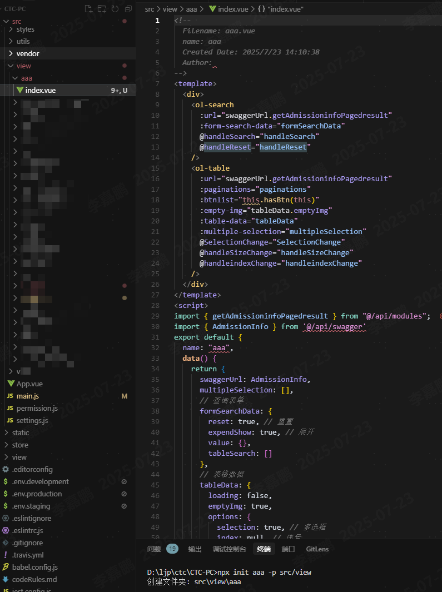

# base-component

二次封装的通用组件库，包含表格（Table）和表单（Form）等组件。

- [在线演示](https://mqtt-a.vercel.app/home)
- [在线文档](https://github.com/time202051/base-component)

## 安装

您可以通过 npm 安装这个组件库：

```bash
npm install ol-base-components
npm install swagger-client@3.0.1
```

## 效果图



## 使用说明

- **基本用法**：通用常规组件，ol-table ol-search ol-dialogTemplate
- **带 Swagger 支持的用法**：适用于需要从 Swagger API 获取数据的场景。提供 swaggerInstall 和 swaggerUnload 实现初始化和销毁 swagger 数据

### 1. 基本用法

```javascript
// main.js
import Vue from "vue";
import App from "./App.vue";
import OlBaseComponents from "ol-base-components"; // 导入组件库

// 使用组件库
Vue.use(OlBaseComponents);

new Vue({
  render: (h) => h(App),
}).$mount("#app");
```

### 2. 带 Swagger 支持的用法

```javascript
// main.js
import Vue from "vue";
import App from "./App.vue";
import OlBaseComponents from "ol-base-components"; // 导入组件库

// 使用组件库
Vue.use(OlBaseComponents);

//安装，可以在登录
import { swaggerInstall } from "ol-base-components";
swaggerInstall("http://192.168.xxx.xxx:20019/swagger/v1/swagger.json").then(
  () => {
    // 成功获取swagger数据后加载页面， 这里可以写登录接口成功后执行的逻辑
  }
);

// 卸载
import { swaggerUnload } from "ol-base-components";
swaggerUnload();
```

## API 脚本

### 1. `api.js`

`api.js` 脚本用于从指定的 Swagger URL 获取 API 数据，并生成相应的 API 模块文件。

#### 使用方法

```bash
npx api http://192.168.xxx.xxx [outputPath]
```

- **参数**：
  - `http://192.168.xxx.xxx` 是 Swagger API 的基础 URL。
  - `[outputPath]` 是可选参数，指定生成的文件路径，默认为 `src/api/swagger.js`。
- **作用**：该脚本会自动生成 Swagger 数据的 API 接口模块，并保存到指定的目录中，且包含 JSDoc，方便查看接口入参及类型。

#### 效果图



### 2. `run.js`

`run.js` 脚本用于从指定的 Swagger URL 下载 Swagger JSON 文件，并生成相应的 API 模块文件。

#### 使用方法

```bash
npx run http://192.168.xxx.xxx [outputPath]
```

- **参数**：
  - `http://192.168.xxx.xxx` 是 Swagger API 的基础 URL。
  - `[outputPath]` 是可选参数，指定生成的文件路径，默认为 `src/api/modules`。
- **作用**：该脚本会从指定的 Swagger URL 下载 Swagger JSON 数据，并生成相应的 API 接口路径文件。

#### 效果图



### 3 `init.js` 命令（推荐）

`init.js` 就是同时执行 api.js 和 run.js 的命令。生成的文件路径为默认路径（不支持自定义输出路径）

```bash
# 基本用法
npx init http://192.168.xxx.xxx:20019
```

### 4 `add.js` 命令

`add.js` 脚本用于创建新的模块。它会根据提供的模块名称在指定路径下生成一个新的文件夹，并在其中创建一个 Vue 组件文件。

#### 使用方法

```bash
npx init <moduleName> -p <customPath> -u <pageUrl> -e <exportUrl> -m <swaggerModule>
```

- **参数**：
  - `<moduleName>`: 要创建的模块名称（必填）。
  - `-p <customPath>`: 指定创建模块的自定义路径(可选)。如 src/view
  - `-u <pageUrl>`: 指定创建模块的分页接口 url 地址(可选)。如 /api/app/business-report/stock-bIPaged-result
  - `-e <exportUrl>`: 指定创建模块的导出接口 url 地址(可选)。如 /api/app/business-report/export-stock-bI
  - `-m <swaggerModule>`: 指定创建模块的 swagger 模块名称(可选)。如 BusinessReport

#### 示例

```bash
npx add aaa -p src/view -u /api/app/business-report/stock-bIPaged-result -e /api/app/business-report/export-stock-bI -m BusinessReport
```

这将会在 `./src/view` 目录下创建一个名为 `aaa` 的文件夹，并在其中生成一个 `index.vue` 文件，文件内容将基于模板生成。

#### 效果图



#### 注意事项

- 确保在执行命令之前已经安装了 `ol-base-components` 包。
- 如果指定的路径已存在同名文件夹，脚本将提示创建失败。

## 组件示例

### 搜索框组件

您可以在您的组件中使用搜索框组件组件，例如：

```vue
<template>
  <div>
    <ol-search
      :form-search-data="formSearchData"
      @handleSearch="handleSearch"
      @handleReset="handleReset"
    />
  </div>
</template>

<script>
export default {
  data() {
    return {
      formSearchData: {
        reset: true,
        expendShow: false,
        value: {
          WarehouseCode: null,
          WarehouseName: null,
        },
        tableSearch: [
          {
            label: "仓库编码",
            value: "WarehouseCode",
            inputType: "text",
          },
          {
            label: "仓库名称",
            value: "WarehouseName",
            inputType: "text",
          },
        ],
      },
    };
  },
  mounted() {
    this.getTable();
  },
  method: {
    getTable() {
      //   this.get({
      //     url: Basic.getWarehoseList,
      //     isLoading: true,
      //     data: Object.assign(this.formSearchData.value, {
      //       Page: this.paginations.page,
      //       MaxResultCount: this.paginations.limit,
      //     }),
      //   }).then((res) => {
      //     this.tableData.rows = res.result.items;
      //     this.paginations.total = res.result.totalCount;
      //     this.tableData.emptyImg = true;
      //   });
    },
    handleSearch(from) {
      var self = this;
      self.formSearchData.value = { ...from };
      self.paginations.page = 1;
      this.getTable(); // 获取表格数据
    },
    handleReset() {},
  },
};
</script>
```

### 表格组件

##### 1. 您可以在您的组件中使用表格组件组件

##### 2. 您可以在 ol-table 添加 url 参数接收完整的 swagger 地址，会自动帮您生成 tableData.columns。您也可以在 columns 中添加，当 prop 相同时候，会自动合并，且 columns 权限大。

例如：

```vue
<template>
  <div>
    <ol-table
      :paginations="paginations"
      :btnlist="this.hasBtn(this)"
      :empty-img="tableData.emptyImg"
      :table-data="tableData"
      :multiple-selection="multipleSelection"
      @SelectionChange="SelectionChange"
      @handleSizeChange="handleSizeChange"
      @handleindexChange="handleindexChange"
    >
      <template slot="classes" slot-scope="scope">
        <div style="color: #1682e6; cursor: pointer" @click="config(scope)">
          设置
        </div>
      </template>
    </ol-table>
  </div>
</template>

<script>
export default {
  data() {
    return {
      multipleSelection: [],
      tableData: {
        loading: false,
        emptyImg: true,
        options: {
          selection: true, //多选框
          index: null, //序号
          headTool: true, //开启头部工具栏
          refreshBtn: true, //开启表格头部刷新按钮
          downloadBtn: true, //开启表格头部下载按钮
        }, //序号和复选框
        rows: [], //表数据
        columns: [
          {
            label: "",
            minWidth: "",
            type: "selection",
            show: true,
          },
          {
            prop: "warehouseCode",
            label: "仓库编码",
            minWidth: "",
            sortable: false,
            show: true,
          },
          {
            prop: "warehouseName",
            label: "仓库名称",
            minWidth: "",
            sortable: false,
            show: true,
          },
          {
            prop: "enabledDesc",
            label: "状态",
            minWidth: "",
            sortable: false,
            show: true,
          },
          {
            prop: "createdUser",
            label: "创建人",
            minWidth: "",
            sortable: false,
            show: true,
          },
          {
            prop: "createTime",
            label: "创建时间",
            minWidth: "",
            show: true,
          },
          {
            prop: "classes",
            label: "班次",
            minWidth: "",
            show: true,
            renderSlot: true,
          },
          {
            prop: "remark",
            label: "备注",
            minWidth: "",
            show: true,
          },
        ], //表头
        operates: [], //表格里面的操作按钮
        tableHeightDiff: 300,
      },
      paginations: {
        page: 1, //当前位于那页面
        total: 10, //总数
        limit: 30, //一页显示多少条
        pagetionShow: true,
      },
    };
  },
  methods: {
    SelectionChange(row) {
      this.multipleSelection = row;
    },
    handleSizeChange(val) {
      this.paginations.page = 1;
      this.paginations.limit = val;
      this.getTable();
    },
    handleindexChange(val) {
      this.paginations.page = val;
      this.getTable();
    },
  },
};
</script>
```

### 表单弹框组件

您可以在您的组件中使用表单弹框组件组件，例如：

```vue
<template>
  <div>
       <ol-dialogTemplate :form="form" />
    </ol-table>
  </div>
</template>

<script>
export default {
  data() {
    return {
      form: {
        dialogFormVisible: false,
        title: "",
        model: [
            {
                label: "字典编码",
                type: "input",
                prop: "code",
            },
            {
                label: "字典名称",
                type: "input",
                prop: "displayName",
            },
            // {
            //     label: "启用",
            //     type: "switch",
            //     prop: "enabled",
            // },
            {
                label: "备注",
                type: "textarea",
                prop: "remark",
            },
        ],
        rules: {
            displayName: [{ required: true, message: "必填", trigger: "blur" }],
            code: [{ required: true, message: "必填", trigger: "blur" }],
        },
        value: {
            code: "",
            displayName: "",
            // enabled: true,
            remark: "",
        },
        requestData: {
            flage: "add",
            url: PublicAggregate.dictionaries,
            fn: this.getTable,
        },
      ,
    };
  },
};
</script>
```

## 贡献

欢迎任何形式的贡献！如果您有建议或发现问题，请提交 issue 或 pull request。

## License

MIT License
